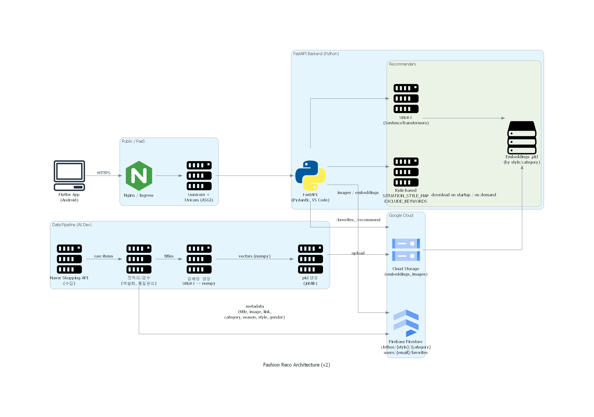

# 🎓 여대생 맞춤형 코디 추천 서비스

## 🧥 서비스 개요
기존 스타일 추천 서비스는 출근룩, 데이트룩 등 일반적인 TPO 중심으로 구성되어 있어,  
대학생들의 다양한 생활 패턴(시험, 팀플, 엠티 등)을 반영하지 못합니다.  
본 프로젝트는 **계절, 상황, 스타일**을 고려하여, **여대생만의 라이프스타일에 맞는 코디를 추천**하는 시스템을 개발하고자 합니다.

이 서비스를 통해 대학생들은 **실용적이면서도 자신만의 스타일을 표현**할 수 있으며,  
코디 추천과 함께 스타일 데이터를 체계적으로 기록, 관리할 수 있습니다.

---

## 🤖 핵심기능
**1. 앱 기능**: 
모바일 앱 형태로 제공되어, 사용자가 언제 어디서든 편리하게 추천 서비스와 즐겨찾기 기능을 이용할 수 있습니다.

**2. 회원 서비스**: 
회원가입과 로그인을 통해 개인 계정을 생성하고, 즐겨찾기한 데이터를 기반으로 사용자의 취향에 최적화된 맞춤형 추천을 제공합니다.

**3. 즐겨찾기 기능**: 
마음에 드는 상품을 개인 계정에 저장할 수 있는 기능입니다.
저장된 즐겨찾기 데이터는 이후 추천 서비스에서 활용되어, 더 정교하고 개인화된 추천을 가능하게 합니다.

**4. 추천 서비스 기능**: 
사용자의 스타일, 상황, 계절 등의 정보를 바탕으로 최적화된 상품을 추천합니다. 즐겨찾기한 상품 데이터를 함께 활용하여, 개인의 취향과 선호도를 반영한 맞춤형 추천 결과를 제공합니다.

---

## 🎀 서버 아키텍처

---

## ✨ 기능 동작 사진

   
  <b>1. 안드로이드 앱</b>

   
  <b>2. 로그인(자동 회원가입)</b>

   
  <b>3. 계절, 상황 선택</b>

   
  <b>4. 스타일 선택</b>

---

## 🛠️ 기술 스택

### 🐍 언어 

### 📚 프레임워크 / 라이브러리

### ☁️ 데이터베이스 / 백엔드 서비스

### 🔌 API

### 💻 개발 도구 / IDE

### 🤝 버전 관리 / 협업

---

## 🚀 향후 확장 방향

- **타겟 확장**: 직장인, 여행객 등 다양한 사용자층으로 확대  
- **AI 고도화**: 사용자 피드백 기반으로 최신 패션 트렌드 반영  
- **패션 커뮤니티화**: 사용자 간 코디 공유 및 피드백 플랫폼 구축  
- **트렌드 분석**: 연령·성별별 선호 스타일 및 시즌별 인기 분석 기능 추가
- **코디 조합 추천**: 사용자의 선호도와 보유 의상 데이터를 기반으로 상하의 매칭 제안

---

## 🙌 팀원 소개

| Yeowon Kim | Dawon Hwang | Chaewon Yoo | Jinseo Lee | Jaein Lee |
|------------|-------------|-------------|------------|-----------|
|  |  |  |  |  |
| - Lead      - Backend   - AI | - Backend   - AI | - Backend   - AI | - Frontend | - Frontend |

---

## 📄 라이선스

해당 프로젝트는 **교내 비영리 목적**으로 진행되며, 외부 배포 및 상업적 사용은 제한됩니다.  
추후 필요 시 라이선스 및 오픈소스 정책은 별도로 고지할 예정입니다.
